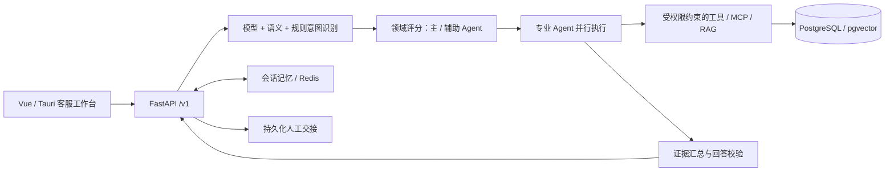

# ServeMind · 智应客服

ServeMind 是面向多领域智能客服的多 Agent 项目。目前包含电商领域适配器：商品咨询、订单核验、规则检索及商家交接。通用编排与领域工具分离，其他领域需要接入自己的意图、角色、知识和业务数据。

## 架构



- 商业主链路使用自研领域路由与线程池并行执行；主、辅助角色的结论按顺序交给 Composer。采用与 EchoMind 当前实现相近的外层协作方式。
- 专业 Agent 使用有界模型工具循环，服务端强制角色、Skill、参与者及数据范围权限。答案绑定字段和来源，校验失败使用安全回退。
- PostgreSQL 保存业务、会话和语义记忆；Redis 提供工作记忆、缓存与协调。Qwen Embedding/Reranker、pgvector 和 MCP 支持公共规则检索。
- Prometheus 指标、健康探测、熔断、独立回归与人工审核门禁提供运行治理。
- 研究路径保留依赖 DAG 调度。商业主路径使用无依赖的角色并行执行，未引入 LangGraph Functional API 或 Graph API。

## 源码结构

| 路径 | 内容 |
| --- | --- |
| `backend/src/servemind/agents` | 意图识别、领域路由、专业角色与执行器 |
| `backend/src/servemind/core` | 证据、权限、规则检索与回答校验 |
| `backend/src/servemind/mcp` | 工具治理、MCP 与业务数据适配 |
| `backend/src/servemind/service` | 商业会话、存储、交接与事务 |
| `backend/src/servemind/memory` | 会话及语义记忆 |
| `backend/src/servemind/monitor` | 监控、指标与运行状态 |
| `backend/sql` / `backend/tests` | 数据库定义与回归测试 |
| `backend/skills` / `knowledge` | 运行必需的权限规则与示例领域知识 |
| `frontend` | Vue 工作台与 Tauri 桌面壳 |
| `config` / `docker-compose.yml` | 可选部署配置 |

## 本地运行

需要 Python 3.12+、Node.js，以及所选运行模式的 PostgreSQL/pgvector、Redis 和模型服务。模型权重和数据需要单独准备；历史 MSOM 数据导入路径为 `data/MSOM_Data_Driven_Challenge_2020/`，数据不随仓库发布。

```sh
python3.12 -m pip install -e 'backend[mcp,rag]'
cd frontend
npm ci
npm run dev -- --host 127.0.0.1
```

从仓库根目录启动后端：

```sh
PYTHONPATH=backend/src python3.12 -m uvicorn servemind.api.main:app --host 127.0.0.1 --port 8317
```

配置从进程环境或本机 `backend/.env` 读取。关键变量包括 `SERVEMIND_DATABASE_URL`、`SERVEMIND_COMMERCE_BACKEND`、`SERVEMIND_REDIS_URL`、`SERVEMIND_MODEL_CACHE`、`SERVEMIND_AGENT_MODE`、`DEEPSEEK_API_KEY` 和前端 `VITE_SERVEMIND_API_BASE_URL`。具体默认值见 `backend/src/servemind/config/settings.py` 及使用处。旧安装的 `VERICARTDESK_*` 配置仍可读取，新变量优先。

Web 默认端口 5317，API 默认端口 8317；探测入口为 `/v1/health`、`/v1/ready` 和 `/metrics`。Compose 模板使用独立数据库和运行目录，需要自行提供本地环境配置，不应挂载现有生产数据库目录。

## 发布范围

仓库包含源码、构建清单和必要架构说明。环境文件、内部文档和工作记录、原始业务数据、账号与消息、数据库、模型缓存及评测报告均不发布。示例知识与测试用例用于开发，不能替代真实业务规则或人工审核；当前实现尚未通过完整生产发布门禁。
